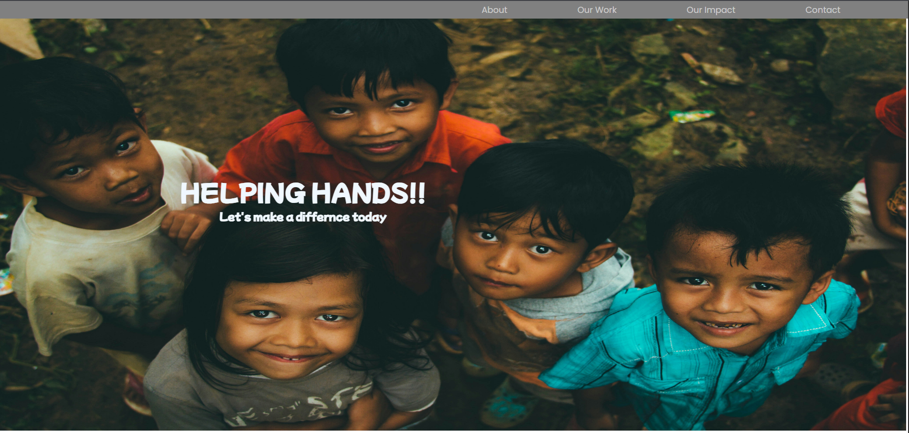

# 🌍 NGO Website



> A modern NGO web application built with **HTML**, **CSS**, **JavaScript**, and **MongoDB** — helping people connect, donate, and adopt ❤️

---

## ✨ Features

✅ **User Authentication** — Login & Register with full validation  
✅ **Donation Section** — Support our mission through secure donations  
✅ **Adoption Section** — View and adopt from our listed programs  
✅ **Projects & Programs** — Showcase of ongoing and completed NGO initiatives  
✅ **Responsive Design** — Works seamlessly on desktop, tablet, and mobile  

---

## 📂 Tech Stack

| Frontend | Backend | Database |
|----------|---------|----------|
| HTML5 | Node.js + Express.js | MongoDB |
| CSS3 | JavaScript (ES6+) | Mongoose |
| JavaScript |  |  |

---

## 📸 Screenshots

### 🏠 Home Page


### ❤️ Donate Page


### 🐾 Adopt Page


---

## 🚀 Installation & Setup

1. **Clone the repository**
   ```bash
   git clone https://github.com/yourusername/ngo-website.git
   cd ngo-website
2. Install dependencies

npm install
Configure environment variables

Create a .env file in the root folder

3.Add your MongoDB connection string:


MONGO_URI=your_mongodb_connection_string
PORT=5000

4.Run the application
npm start

5.Open in browser

http://localhost:5000

🛠 Folder Structure

ngo-website/
│── public/         # Images, CSS, client-side JS
│── views/          # HTML templates
│── routes/         # Express routes
│── models/         # Mongoose schemas
│── app.js          # Main server file
│── package.json
│── .env

🌟 Contribution
We welcome contributions!
Feel free to fork the repo and submit a pull request with improvements.

